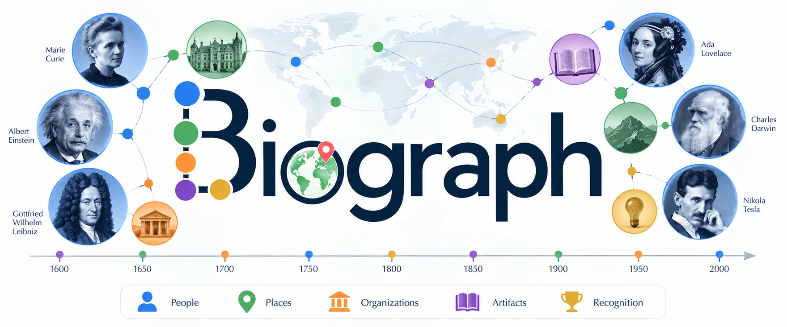

<h1 align="center">
  
</h1>

<p align="center">
  Turn a biographical paper about a scientist into an explorable knowledge graph —
  every event dated, cited, and quoted from the source.
</p>

<p align="center">
  <a href="https://biograph.readthedocs.io/">Documentation</a> ·
  <a href="https://biograph.readthedocs.io/en/latest/data-model/">Data model</a> ·
  <a href="https://biograph.readthedocs.io/en/latest/access/">Access report</a> ·
  <a href="LICENSE">MIT</a>
</p>

---

## Try it in 30 seconds

A finished subject ships with the repo, so you can see the output before installing anything that talks to a model.

```bash
pip install jsonschema
python3 scripts/build_site.py suntola
```

Open `dist/suntola.html` in a browser. One self-contained file, no server:

| View | What it shows |
|---|---|
| **Network** | People, places, organizations and inventions, linked by what the source actually says |
| **Map** | Everywhere the life touched, pinned from Wikidata |
| **Timeline** | Every dated event, click through to its citation and quote |

## How it works

You give it a paper. It returns four JSON files per document — `entities`, `events`, `relations`, `sources` — validated against [`schema/`](schema/), then rendered into a single HTML page.

The rule that shapes everything: **every event and relation must cite its page and quote the sentence that states it, verbatim.** Quotes are then checked back against the source mechanically, so an invented fact shows up as a quote that isn't there.

→ [Why the model never supplies dates, coordinates or photos it wasn't given](https://biograph.readthedocs.io/en/latest/data-accuracy/)

## Install

Python 3.8+ and a browser. Extraction additionally needs an API key for any OpenAI-compatible provider.

```bash
pip install -r extraction/requirements.txt
```

## Usage

### 1. Draft a subject from a paper

```bash
python3 scripts/build_site.py <slug> --pdf data/<paper>.pdf
```

Takes a PDF or a `.txt` (`--text`). Prompts for provider, model and key — or pass `--base-url` / `--model` / `--api-key`, or set the matching `BIOGRAPH_*` env vars. No model is hardcoded.

The same call decides whether the document is in scope at all; if it isn't, nothing is written.

→ [What counts as in scope](https://biograph.readthedocs.io/en/latest/usage/) · [Authoring a subject by hand](extraction/EXTRACTION_GUIDE.md)

### 2. Check the quotes

```bash
python3 scripts/build_site.py <slug> --check-grounding
```

Reports any quote not found verbatim in the source. Mechanical, no second model call.

**Treat every draft as a first pass, not ground truth.** Review it against the paper.

### 3. Build the page

```bash
python3 scripts/build_site.py <slug>     # one subject
python3 scripts/build_site.py --all      # rebuild everything
```

Merges every document folder for that subject, validates structure and referential integrity, writes `dist/<slug>.html`. Re-run after editing any JSON by hand.

### 4. Add portraits and map pins

```bash
python3 scripts/find_portraits.py <slug>              # verified Wikidata/Commons photos
python3 scripts/geocode_places.py --subject <slug>   # coordinates for the map
```

Both refuse to guess: a person whose identity can't be confirmed gets no photo, and a place that can't be pinned down stays off the map.

→ [Portraits](https://biograph.readthedocs.io/en/latest/data-accuracy/#portraits) · [Place coordinates](https://biograph.readthedocs.io/en/latest/data-accuracy/#place-coordinates)

## What's in here

174 subjects across six collections, built by pointing the same code at six different taxonomies — nothing in it names a field.

| Collection | Subjects |
|---|---:|
| Physics | 53 |
| Chemistry | 44 |
| Materials science | 33 |
| Life sciences and medicine | 27 |
| Computer science | 9 |
| Earth and space sciences | 8 |

A subject is a **person**; each paper about them becomes its own folder, kept whole and separate. Two papers are two accounts, reconciled when the subject is read rather than at write time.

```
subjects/materials_science/suntola/
  subject.json          the person: canonical name, slug, domains[]
  puurunen_2014/        one document's extraction
    entities.json       people, places, organizations, artifacts
    events.json         dated occurrences, each cited — the timeline
    relations.json      durable links (worked_at, invented, ...)
    sources.json        the document, for citation
  aris_2019/            a second account of the same life
```

→ [Defining your own collection](https://biograph.readthedocs.io/en/latest/defining-a-domain/)

## Repository layout

| Path | What it is |
|---|---|
| `schema/` | The data model, as JSON Schema |
| `subjects/<domain>/<slug>/` | One person, in the collection they were found for |
| `scripts/` | `build_site.py` (extract, validate, build), `find_portraits.py`, `geocode_places.py`, `access_report.py` |
| `frontend/` | `template.html` — the D3 explorer |
| `dist/` | Generated self-contained pages |
| `extraction/` | Hand-authoring guide and its requirements |
| `docs/` | Documentation source (MkDocs) |
| `data/` | Archived source text — gitignored, see [`data/README.md`](data/README.md) |

## Sources and licence

The code, schemas and the extracted JSON under `subjects/` are **MIT** ([`LICENSE`](LICENSE)).

That does not extend to the papers the subjects are drawn from — each stays under its own publisher's terms, which is why `data/*.pdf` and `data/*.txt` are gitignored. What's shared instead is the citation: every source is fully described in its `sources.json`, with a DOI wherever one exists.

Building this corpus also produced a measurement of how much of the biographical record a machine is actually allowed to read. Of 3,122 documents attempted, 968 were obtained — and the single journal most precisely on topic, the Royal Society's *Biographical Memoirs*, refused all 22 requests.

→ [Reading the biographical record](https://biograph.readthedocs.io/en/latest/access/)
